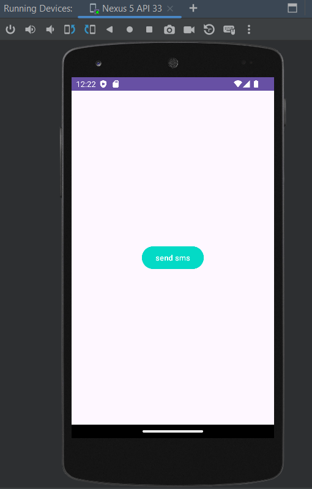

# SMS_Intent

Develop program to create and design an android application to Send SMS using Intent in Android Studio.

## AIM:
To create and design an android application to Send SMS using Intent in Android Studio.

## EQUIPMENTS REQUIRED:

Android Studio(Min. required Artic Fox)


## ALGORITHM:
Step 1: Open Android Studio and then click on File -> New -> New project.

Step 2: Then type the Application name as SMSIntent and click Next.

Step 3: Select the Minimum SDK below and click Next.

Step 4: Then select the Empty Activity and click Next. Finally, click Finish.

Step 5: Design layout in activity_main.xml.

Step 6: Send SMS and Display details given in the MainActivity file.

Step 7: Save and run the application.


## Program:
 ```
/*
Program to create and design an android application for Sending  SMS using Intent.
Developed by: SATHISH R
RegisterNumber: 212222100048
*/
```

## MainActivity.java:
```java
package com.example.ex3;

import androidx.appcompat.app.AppCompatActivity;

import android.os.Bundle;
import androidx.appcompat.app.AppCompatActivity;

import android.content.Intent;
import android.net.Uri;
import android.os.Bundle;
import android.view.View;
import android.widget.Button;
public class MainActivity extends AppCompatActivity {

    @Override
    protected void onCreate(Bundle savedInstanceState) {
        super.onCreate(savedInstanceState);
        setContentView(R.layout.activity_main);
        Button mbutton=(Button) findViewById(R.id.smsButton);
        mbutton.setOnClickListener(new View.OnClickListener() {
            @Override
            public void onClick(View view) {
                Intent intent =new Intent(Intent.ACTION_VIEW, Uri.fromParts("sms","2596118700",null));
                intent.putExtra("sms_body","SMS using Intent");
                startActivity(intent);
            }
        });

    }
}
```
## activity_main.xml:
```xml
<?xml version="1.0" encoding="utf-8"?>
<RelativeLayout xmlns:android="http://schemas.android.com/apk/res/android"
    xmlns:app="http://schemas.android.com/apk/res-auto"
    xmlns:tools="http://schemas.android.com/tools"
    android:layout_width="match_parent"
    android:layout_height="match_parent"
    tools:context=".MainActivity">

    <Button
        android:id="@+id/smsButton"
        android:layout_width="wrap_content"
        android:layout_height="wrap_content"
        android:backgroundTint="@color/design_default_color_secondary"
        android:text="send sms"
        android:layout_centerHorizontal="true"
        android:layout_centerVertical="true"/>

</RelativeLayout>
```
## AndroidMainfest.xml
```xml
<?xml version="1.0" encoding="utf-8"?>
<manifest xmlns:android="http://schemas.android.com/apk/res/android"
    xmlns:tools="http://schemas.android.com/tools">

    <application
        android:allowBackup="true"
        android:dataExtractionRules="@xml/data_extraction_rules"
        android:fullBackupContent="@xml/backup_rules"
        android:icon="@mipmap/ic_launcher"
        android:label="@string/app_name"
        android:roundIcon="@mipmap/ic_launcher_round"
        android:supportsRtl="true"
        android:theme="@style/Theme.Ex3"
        tools:targetApi="31">
        <activity
            android:name=".MainActivity"
            android:exported="true">
            <intent-filter>
                <action android:name="android.intent.action.MAIN" />

                <category android:name="android.intent.category.LAUNCHER" />
            </intent-filter>
        </activity>
    </application>

</manifest>
```
## OUTPUT:




## RESULT:
Thus a Simple Android Application to create and design an android application for Sending SMS using Intent in Android Studio was developed and executed successfully.
